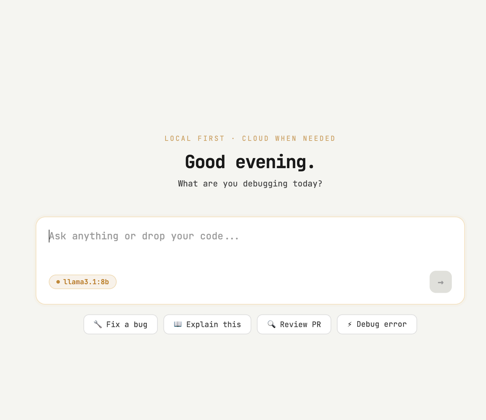
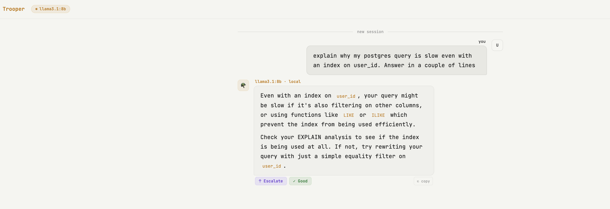
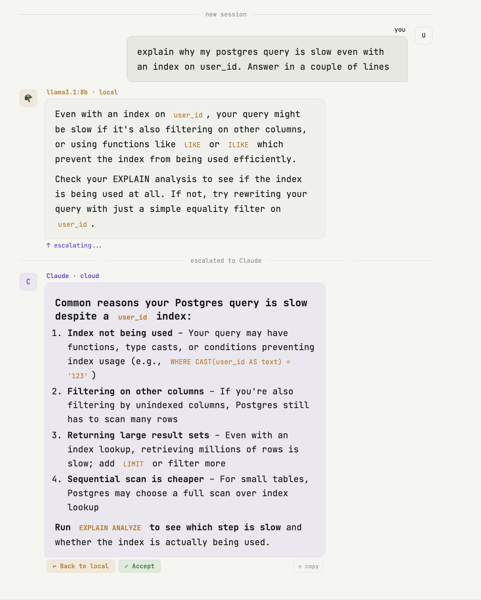

**NEW:** [Chat UI demo →](http://127.0.0.1:3000/chat) | [Subagent recovery demo →](https://youtu.be/NN2uwQZDCck) | [Subagent recovery article →](https://dev.to/shouvik12/i-added-a-recovery-endpoint-to-my-llm-proxy-so-agents-never-lose-progress-mid-task-524b) | [4-agent privacy routing demo →](https://dev.to/shouvik12/i-tested-privacy-aware-routing-with-4-ai-agents-what-actually-stayed-local-39oa)

# 🪖 Trooper

> **Trooper 4.0 — Chat UI with escalate. Local first. Cloud when needed. One click to switch. Context never lost.**

Trooper started as a fallback proxy. It's now a local-first AI workspace.

Your agent runs. Trooper watches. You chat. You escalate. Context flows. Nothing breaks.

```
→ Any agent          → point at Trooper, open dashboard, see everything
→ Chat with Llama    → fast, free, private by default
→ Need more power    → one click escalates to Claude with full context
→ Back to local      → Llama knows everything Claude said
→ Claude fails       → continues on Ollama, context preserved
→ Simple prompts     → never hit the cloud
```

**Trooper is a zero-instrumentation agent observability platform with local fallback — and now a local-first chat interface.**



---

## What's new in 4.0

**Chat UI** — open `http://localhost:3000/chat`:

- **Local first** — all messages route to your local Ollama model by default
- **One-click escalate** — stuck on something? Escalate to Claude with full session context injected automatically
- **Context never lost** — back to local, Llama knows exactly what Claude said
- **SITREP panel** — live intent, confidence, entities, open loops extracted from your conversation
- **Markdown rendering** — code blocks, tables, headers render cleanly
- **Session memory** — full conversation history flows between providers

---

## What you see

**In the chat UI** — open `http://localhost:3000/chat`:

```
Local first. Escalate when stuck. Context never lost.

Dev: explain why my postgres query is slow despite an index on user_id

Llama: Even with an index on user_id, your query might be slow if filtering
       on other columns, or using functions like LIKE which prevent index usage.

[↑ Escalate]

— escalated to Claude —

Claude: Common reasons your Postgres query is slow despite a user_id index:
        1. Index not being used — functions, type casts
        2. Filtering on other columns — unindexed columns cause row scans
        3. Returning large result sets — add LIMIT or filter more
        Run EXPLAIN ANALYZE to see which step is slow.

[↩ Back to local]





— returned to local —

Dev: summarize what Claude just recommended

Llama: Your query might be slow due to functions preventing index usage,
       or filtering on unindexed columns. Run EXPLAIN ANALYZE to identify
       which step is slow and whether the index is being used.
```


**In the dashboard** — open `http://localhost:3000/dashboard` while your agent runs:

- **Intent** — what your agent is trying to do, extracted automatically
- **Open Loops** — what it's stuck on, highlighted in real time
- **Completed Steps** — what it finished, tracked as it happens
- **Session Transcript** — every message, colour coded by role

**In every response header** — no dashboards required:

```bash
# Simple question → Ollama handled it, cloud never contacted
X-Trooper-Provider: ollama
X-Trooper-Decision: ollama (simple turn) | cloud skipped
X-Trooper-Session-Saved: 42 tokens

# Complex question → Claude handled it
X-Trooper-Provider: claude
X-Trooper-Summary: claude (direct) ✓

# Claude quota hit → fell back to Ollama, context preserved
X-Trooper-Provider: ollama
X-Trooper-Decision: ollama (fallback: credit_balance)
X-Trooper-Session-Saved: 42 tokens
```

---

## What Trooper is

Trooper is a drop-in proxy that sits between your agent (or you) and any LLM provider. It observes every request, extracts intent and signals, and builds a live picture of what's happening — all without touching your code.

When cloud models fail — quota, rate limits, outages — it automatically falls back to your local Ollama instance while preserving full conversation context.

**Trooper is no longer passive.** It started as a fallback proxy. Now it watches every session, makes that data visible, and gives you a local-first chat interface to work with.

No retries. No crashes. No lost sessions. No SDK. No instrumentation. ⏱ Runs in under 60 seconds.

---

## Who uses Trooper

**Local LLM developers** — run Ollama for privacy and cost, escalate to Claude when you need more. Context flows automatically. No copy-pasting, no re-explaining.

**Agent builders** — see exactly what your agent is doing, what it's stuck on, and what it completed. Zero instrumentation — just point your agent at Trooper.

**App developers** — your users never see quota errors. Trooper falls over to local Ollama transparently while your app keeps running.

**Claude Code / Cursor users** — coding sessions survive quota hits. No lost context, no starting over.

**Privacy-conscious developers** — sensitive requests stay local. Cloud only when you choose.

---

## Why not LiteLLM, Bifrost, or Helicone

| | LiteLLM / Bifrost | Helicone | Trooper |
|---|---|---|---|
| Chat UI | ❌ | ❌ | ✅ Local-first with escalate |
| Context handover | ❌ | ❌ | ✅ Full context on provider switch |
| Observability | ❌ | Request-level only | ✅ Intent, open loops, completed steps |
| Instrumentation needed | SDK required | None | None |
| Fallback target | Another cloud | Another cloud | Your local machine |
| Local / private | ❌ | ❌ Cloud only | ✅ Data never leaves machine |
| Setup | `pip install`, YAML | API key, cloud account | One Go binary, env vars |
| Status | Active | Maintenance mode | Active |

---

## Quickstart

⏱ Runs in under 60 seconds.

### Option 1 — Docker (no Go required)

```bash
git clone https://github.com/shouvik12/trooper
cd trooper
cp .env.example .env
# edit .env — set CLAUDE_API_KEY
docker compose up

# First run: pull the model
docker compose exec ollama ollama pull llama3.1:8b
```

### Option 2 — Run from source (Go 1.22+)

```bash
git clone https://github.com/shouvik12/trooper
cd trooper
export CLAUDE_API_KEY=sk-ant-...   # optional — works without it
export OLLAMA_MODEL=llama3.1:8b
go run .
```

Open the chat UI: `http://localhost:3000/chat`
Open the dashboard: `http://localhost:3000/dashboard`

---

## Chat UI

```bash
open http://localhost:3000/chat
```

**How it works:**

1. Messages default to your local Ollama model — free, private, fast
2. Not satisfied? Click **↑ Escalate** — Claude receives full session context automatically
3. Claude answers. Click **↩ Back to local** — Llama picks up with full context of what Claude said
4. SITREP panel updates live — intent, confidence, entities, open loops

**No copy-pasting. No re-explaining. Context never lost.**

---

## Agent usage

Point your existing client at Trooper — nothing else changes:

**Python + Anthropic SDK:**
```python
import anthropic
client = anthropic.Anthropic(
    api_key="your-key",
    base_url="http://localhost:3000",  # only change
)
```

**Python + OpenAI SDK:**
```python
from openai import OpenAI
client = OpenAI(
    api_key="your-key",
    base_url="http://localhost:3000",  # only change
)
```

**curl:**
```bash
curl http://localhost:3000/v1/messages \
  -H "Content-Type: application/json" \
  -H "X-Session-ID: my-session" \
  -d '{"model": "claude-haiku-4-5", "max_tokens": 1024, "messages": [{"role": "user", "content": "Hello!"}]}'
```

---

## Smart routing

Trooper decides when the cloud is overkill.

> **The classifier is rule-based and deterministic — no LLM call, no latency, no cost to classify.**

```
"how many days in a week"  →  Ollama directly 🪖  (cloud never contacted)
"explain why goroutines…"  →  Claude ✅           (needs reasoning)
```

---

## How Trooper handles context

The hard part of fallback isn't switching models — it's keeping context.

Trooper solves that with a 3-layer compaction system:

```
ANCHOR  (~10%)  — First 2 turns verbatim, never dropped
SITREP  (~20%)  — Rule-based summary of middle turns
TAIL    (~70%)  — Last N turns verbatim
                  Total <= 6144 tokens (configurable)
```

---

## Provider chain

```bash
CLAUDE_API_KEY=sk-ant-...                          # Chain: Claude → Ollama
CLAUDE_API_KEY=sk-ant-...  GEMINI_API_KEY=AIza...  # Chain: Claude → Gemini → Ollama
CLAUDE_API_KEY=sk-ant-...  OPENAI_API_KEY=sk-...   # Chain: Claude → OpenAI → Ollama
```

---

## Fallback behaviour

| Status | Trooper action |
|---|---|
| `200 OK` | Pass through |
| `429 Rate Limited` | Retry with 2s backoff, then try next |
| `402 Payment Required` | Fall back immediately |
| `400 Credit Balance / Invalid Key` | Fall back immediately |
| `401 Unauthorized` | Surface error — bad keys are never masked |
| `529 Overloaded` | Fall back immediately |
| Network error | Fall back immediately — 30s timeout per provider |

---

## Configuration

| Variable | Default | Description |
|---|---|---|
| `CLAUDE_API_KEY` | — | Anthropic API key |
| `CLAUDE_MODEL` | `claude-haiku-4-5-20251001` | Default Claude model |
| `GEMINI_API_KEY` | — | Google Gemini API key |
| `OPENAI_API_KEY` | — | OpenAI API key |
| `OLLAMA_MODEL` | `llama3.1:8b` | Local model |
| `FALLBACK_URL` | `http://localhost:11434/api/chat` | Ollama endpoint |
| `CONTEXT_WINDOW` | `6144` | Token budget for context compaction |
| `QUOTA_STATUS_CODES` | `429,402,529,400,404` | HTTP codes that trigger fallback |
| `TROOPER_PORT` | `3000` | Port Trooper listens on |
| `TROOPER_BIND` | `127.0.0.1` | Bind address |
| `AUTO_RECOVERY` | `false` | Enable automatic recovery to primary provider |

---

## Recommended local models

| Model | Size | Notes |
|---|---|---|
| `llama3.1:8b` | 4.9GB | Default — strong all-rounder |
| `qwen2.5:3b` | 1.9GB | Fast, lightweight |
| `qwen2.5:7b` | 4.7GB | Better quality, still fast |
| `mistral:7b` | 4.1GB | Good reasoning |

---

## Running tests

```bash
go test ./... -v
./sanity.sh
```

---

## Roadmap

**V4.0 — Released**
- ✅ Chat UI — `localhost:3000/chat`
- ✅ Local-first routing — Ollama by default, Claude on demand
- ✅ One-click escalate with full context injection
- ✅ Back to local — Llama knows what Claude said
- ✅ SITREP panel — live intent, confidence, entities, open loops
- ✅ Markdown rendering — code blocks, tables, headers
- ✅ Session memory across provider switches
- ✅ Provider-aware context store

**V3.3 — Released**
- ✅ Live dashboard — `localhost:3000/dashboard`
- ✅ Sessions endpoint — `localhost:3000/sessions`
- ✅ Zero instrumentation agent observability

**V3.2 — Released**
- ✅ Subagent recovery — `/recovery/{session_id}`
- ✅ Response normalization

**V3.1 — Released**
- ✅ Smart routing — simple turns skip the cloud
- ✅ Deterministic classifier — zero latency to route

**V3.0 — Released**
- ✅ Circuit breaker
- ✅ X-Trooper headers

---

## Recognition

- Featured in [Agent Brief](https://news.agentcommunity.org/issues/2026-04-22-the-agentic-stack) by agentcommunity.org — curated alongside Anthropic, Shopify MCP, and LangGraph updates (April 2026)
- Featured on [@github_unpacked](https://www.instagram.com/reel/DXfDrCOCNHE/) — Instagram reel with 76 saves
- Featured on [PatentLLM](https://media.patentllm.org/news/local-ai/qwen3-6-27b-local-inference-on-rtx-3090-with-native-vllm-oll-20260502) — covered alongside Qwen3.6-27B RTX 3090 local inference story (May 2026)
- Featured on [dev.to](https://dev.to/soytuber/qwen36-27b-local-inference-on-rtx-3090-with-native-vllm-ollama-fallama-fallback-2jgg) — local AI tooling roundup (May 2026)
- Cited by [kylebrodeur](https://github.com/kylebrodeur) as inspiration for *"robust, transparent HTTP rate-limit fallback triggers"*
- Listed on [UND-RDR](https://undrdr.com) — underrated GitHub repo discovery index

---

## License

MIT
